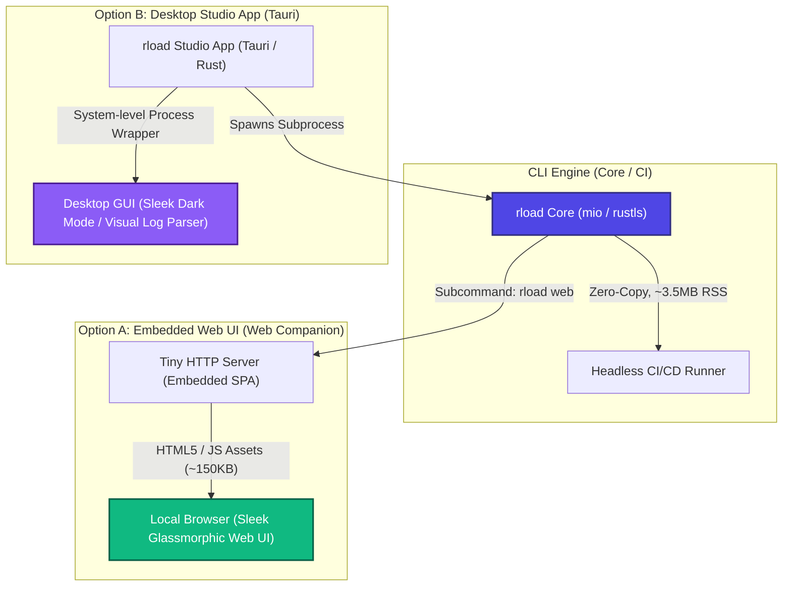

# Strategic Evaluation: Rload GUI Architecture Strategy

This document conducts a strategic and technical evaluation of introducing a Graphical User Interface (GUI) to `rload`. It addresses the core dilemma of balancing premium visual aesthetics with the tool's foundational value proposition: **ultra-lightweight footprint (~3.5 MiB RSS) and C-level high-throughput performance**.

---

## 1. The Core Dilemma: Performance vs. Visual Accessibility

Adding a GUI to a high-performance load testing utility introduces critical architectural trade-offs:

| Evaluation Metric | Native Bundled GUI (e.g., egui, Slint, Qt) | Decoupled Web GUI / Companion (e.g., Embedded SPA, Tauri) | Pure CLI / TUI (Current Base) |
| :--- | :---: | :---: | :---: |
| **Binary Size** | ❌ Large (20MB - 80MB+) | 🥈 Small (additional ~150KB for zipped assets) | 🥇 Minimal (~3.5 MiB) |
| **Memory Footprint** | ❌ High (50MB - 150MB+ for rendering contexts) | 🥇 Ultra-low for core (~3.5MB), browser pays rendering cost | 🥇 Minimal (~3.5 MiB) |
| **CPU Interference** | ❌ High (GPU/UI rendering threads compete with I/O threads) | 🥇 None (browser renders independently of load generator) | 🥇 None (fully dedicated to network execution) |
| **CI/CD Compatibility** | ❌ Poor (headless environments lack rendering libraries/X11) | 🏆 Excellent (core binary remains headless, GUI is optional) | 🏆 Excellent |
| **User Experience (UX)** | 🥈 Good (single desktop app) | 🏆 Outstanding (cross-platform, real-time web graphs) | ❌ Text-only, higher learning curve |

---

## 2. Proposed Solution: The "Two-Tier Decoupled GUI" Strategy

To satisfy both the "must wow the user with premium design" requirement and the "strictly zero performance regression" constraint, we propose a **Two-Tier Decoupled GUI Strategy**.

---

## 3. Tier 1: Embedded Web GUI Companion (`rload web`)

Instead of shipping heavy desktop rendering frameworks, `rload` can embed a pre-compiled, highly optimized **Single Page Application (SPA)** as compressed static bytes (using `include_bytes!`).

### 3.1 Workflow
1. The user runs `rload web --port 8080`.
2. A minimal, non-blocking single-threaded TCP server starts inside `rload`.
3. When accessed via a browser, it serves a premium, glassmorphic dark-mode dashboard (tailored with smooth Tailwind gradients and dynamic charts).
4. **Zero Overhead on Load Generation**: When a test starts, the Web UI communicates with `rload` via an internal WebSocket connection. The browser handles all rendering, charting, and data computations, leaving 100% of the host machine's CPU cycles for `rload`'s network engines.

### 3.2 Visual Mockup Concept & Features
* **Nginx Log Drag-and-Drop Parser**: Users can drag and drop a production Nginx access log directly onto the browser window. The web UI parses it on the client-side (via WebAssembly or JS), validates its schemas, allows filtering paths and status codes via interactive checkbox toggles, and generates the `rload.yaml` profile.
* **Real-time Performance Oscilloscope**: Shows real-time curves for RPS, Active Connections, Socket Errors, and dynamic HdrHistogram percentile curves (P50, P90, P99) during active test runs.
* **Historical Run Matrix**: Displays interactive comparative tables of previous runs to visually pinpoint performance regressions.

---

## 4. Tier 2: Desktop Studio Client (`rload-studio`) using Tauri

If the user prefers a standalone desktop application with double-click installation, we can build a decoupled companion repository, `rload-studio`, using **Tauri**.

### 4.1 Architecture
* **Frontend**: A gorgeous, state-of-the-art Single Page App (Vite + React/Vue + TypeScript + ECharts).
* **Backend (Tauri/Rust)**: Tauri compiles down to a very small binary because it reuses the system's native Webview (WebKit on macOS, WebView2 on Windows) rather than embedding Chromium (like Electron).
* **Engine Execution**: The Tauri backend packages the native `rload` CLI binary inside its bundle. When a test is run, the desktop GUI executes `rload` as an independent OS-level subprocess, streaming real-time JSON metrics (added in v0.2.0: `--output json`) over standard pipes (stdout/stderr).

---

## 5. Timeline & Roadmap Alignment

Integrating the GUI strategy into the strategic roadmap ensures structural progression without scope creep:

1. **Phase 2 (v0.3.0) - Declarative Config & JSON Streams (Ongoing)**:
   Ensure the JSON output format and YAML parser are highly robust. This acts as the stable IPC/API foundation for any GUI integrations.
2. **Phase 3 (v0.4.0) - Embedded Web Server Prototyping**:
   Embed a micro-Web server and WebSocket responder inside the engine. Write a prototype of the Single Page App (Web Companion).
3. **Phase 4 (v1.0.0) - Full GUI Release**:
   Finalize the gorgeous dark-mode dashboard for both `rload web` and launch `rload-studio` as the premium standalone desktop client.
