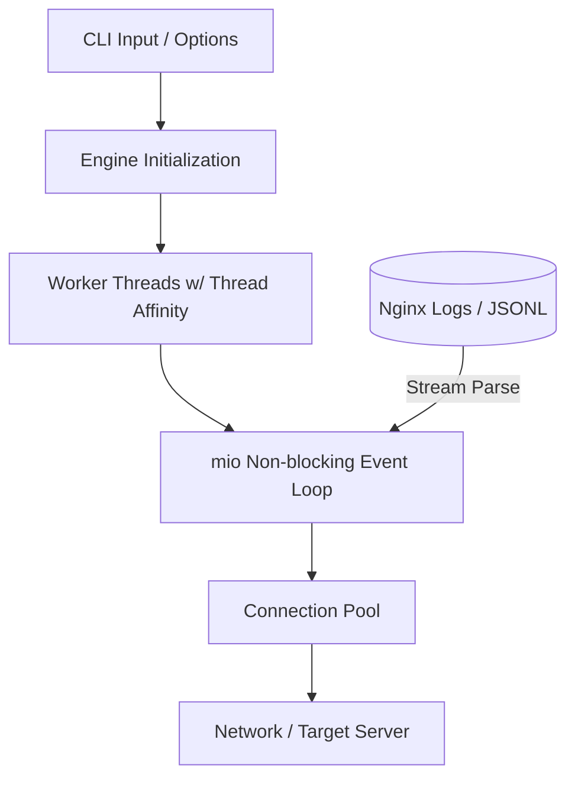

# rload User Guide

Welcome to the official user guide for `rload`—a Rust-native high-performance HTTP load generator and high-fidelity traffic replay engine.

`rload` is designed to bridge the gap between static benchmarking (like `wrk`) and production-grade traffic replay (like shadow testing). It provides absolute compatibility with standard `wrk` CLI semantics while adding stream-based Nginx access-log and structured JSONL request sequence replaying.

---

## Table of Contents

1. [Architecture & Core Concepts](#1-architecture--core-concepts)
2. [Installation Guide](#2-installation-guide)
3. [Basic Benchmarking (wrk Parity)](#3-basic-benchmarking-wrk-parity)
4. [Nginx Access Log Replay](#4-nginx-access-log-replay)
5. [Structured JSONL Request Replay](#5-structured-jsonl-request-replay)
6. [Traffic Pacing & Stage Profiles](#6-traffic-pacing--stage-profiles)
7. [Metrics & Output Formats](#7-metrics--output-formats)
8. [Operational Tuning & SRE Best Practices](#8-operational-tuning--sre-best-practices)

---

## 1. Architecture & Core Concepts

`rload` is built from the ground up to achieve bare-metal efficiency and high accuracy, maintaining a negligible resource footprint even under extreme loads.



### Core Architectural Pillars:
- **Non-blocking Event Loop**: Powered by Rust's `mio` library, `rload` manages thousands of concurrent connections over a fixed set of OS threads.
- **Thread-Affinity & Zero Noise**: Worker threads are pinned to CPU cores where possible, reducing kernel context switching and CPU cache-misses to guarantee precise latency measurements.
- **Constant Memory Footprint**: Rather than loading log files entirely into RAM, `rload` uses stream-based parsers to process massive log files (gigabytes in size) chunk-by-chunk, keeping the RSS memory usage static at around `3.5 MiB`.
- **Coordinated Omission Prevention**: `rload` prevents Coordinated Omission by tracking latency against scheduled send times when pacing is enabled, rather than just measuring round-trip time.

---

## 2. Installation Guide

`rload` is compiled as a single, dependency-free static binary.

### Option A: Homebrew (macOS & Linux)
You can install `rload` via Homebrew from our official tap:
```bash
brew install wenhaozhao/rload/rload
```

### Option B: Cargo (Rust Toolchain)
If you have the Rust toolchain installed, you can build and install directly from crates.io:
```bash
cargo install rload
```

### Option C: Manual Binary Installation
Download the precompiled binary for your platform from the [GitHub Releases](https://github.com/wenhaozhao/rload/releases) page, extract it, and move it to your executable path:
```bash
tar -xvf rload-v0.2.2-x86_64-unknown-linux-musl.tar.gz
sudo mv rload /usr/local/bin/
```

### Option D: Building From Source
```bash
git clone https://github.com/wenhaozhao/rload.git
cd rload
cargo build --release
# Binary will be available at target/release/rload
```

Verify your installation by running:
```bash
rload --version
```

---

## 3. Basic Benchmarking (wrk Parity)

`rload` supports standard `wrk` options, making it a drop-in replacement for your static load testing scripts.

### Basic Options Checklist

| Flag | Long Option | Description | Default |
|---|---|---|---|
| `-t` | `--threads <N>` | Number of worker threads to spawn | `2` |
| `-c` | `--connections <N>` | Concurrent TCP connections | `10` |
| `-d` | `--duration <T>` | Test duration (e.g. `30s`, `5m`, `2h`) | `10s` |
| `-n` | `--requests <N>` | Send exactly N requests (disables duration run) | N/A |
| `-T` | `--timeout <T>` | Connection and request socket timeout | `2s` |
| | `--latency` | Explicitly request latency print (always enabled) | Enabled |

### Syntax & Examples

#### Static GET Benchmarking:
Run a 30-second benchmark using 4 threads and 100 concurrent connections:
```bash
rload -t 4 -c 100 -d 30s http://127.0.0.1:8080/
```

#### Running a Fixed Number of Requests:
Instead of running for a fixed time, send exactly 10,000 requests:
```bash
rload -t 2 -c 50 -n 10000 http://127.0.0.1:8080/
```

---

### Customizing Individual Requests

`rload` includes a curl-compatible CLI subset to customize single-request methods, headers, and request bodies.

- **`-X, --request <METHOD>`**: Specifies the HTTP method (e.g., `GET`, `POST`, `PUT`, `DELETE`).
- **`-H, --header <HEADER>`**: Adds a custom header. This option is repeatable. Must use `'Name: Value'` syntax.
- **`--data <DATA>`**: Specifies the request body string. Multiple `--data` parameters are automatically joined with `&`. Specifying `--data` without `-X` implicitly selects `POST`.
- **`--data-binary @FILE`**: Sends the exact raw binary contents of a file as the request body.

#### Custom POST with Headers:
```bash
rload -d 10s -X POST \
  -H 'Content-Type: application/json' \
  -H 'Authorization: Bearer mytoken' \
  --data '{"username":"admin"}' \
  https://example.com/api/login
```

#### Uploading Binary Files:
```bash
rload -d 30s -X PUT \
  -H 'Content-Type: image/png' \
  --data-binary @/path/to/image.png \
  https://example.com/upload
```

---

## 4. Nginx Access Log Replay

One of `rload`'s most powerful capabilities is replaying production traffic from Nginx access logs natively.

`rload` stream-parses standard **Common** or **Combined** Nginx access logs. It extracts the `$request` field, pulls out the URI and its query parameters, and replays them to your target server, maintaining high fidelity.

```bash
rload [OPTIONS] --access-log <LOG_FILE> <TARGET_URL>
```

### Replay Configuration Options

- **`--replay-order <sequential | shuffle | random>`**:
  - `sequential` (Default): Read and replay log entries chronologically. When the end of the file is reached, it loops back to the start.
  - `shuffle`: Read all entries into memory, shuffle them deterministically, and replay. When a round finishes, they are shuffled again.
  - `random`: Randomly samples entries independently (with replacement) for every request.
- **`--seed <N>`**: Sets a deterministic 64-bit integer seed for the `shuffle` and `random` replay sequences, ensuring exact reproducibility of your test across environments.
- **`--allowed-methods <LIST>`**: Comma-separated method whitelist (e.g. `--allowed-methods GET,HEAD`). Replays matching methods; others are skipped and counted.
- **`--allowed-uris <GLOBS>`**: Comma-separated glob patterns (e.g., `--allowed-uris "/api/v1/*,/products/*"`). Only replays matching URIs.
- **`--replay-rounds <N>`**: Replays the filtered sequence exactly `N` complete times. Cannot be combined with `--requests`, `--duration`, or `random` replay orders.

### Examples

#### Basic Sequential Log Replay:
Replay the access log sequentially against staging:
```bash
rload -c 100 -d 5m --access-log /var/log/nginx/access.log https://staging.example.com
```

#### Reproducible Shuffled Replay with Filters:
Replay only `GET` queries from `/search` patterns, shuffled with a fixed seed:
```bash
rload -c 50 -d 1m \
  --access-log ./access.log \
  --replay-order shuffle --seed 42 \
  --allowed-methods GET \
  --allowed-uris "/search*" \
  https://staging.example.com
```

> [!NOTE]
> Standard access log replay does not support request bodies since Nginx access logs do not contain POST/PUT request body data. Use JSONL Request Replay if you require custom bodies.

---

## 5. Structured JSONL Request Replay

For complex microservice workflows requiring distinct HTTP methods, custom headers, and structured JSON/binary payloads, `rload` supports structured request sequence replay using JSON Lines (JSONL) files.

```bash
rload [OPTIONS] --request-file <JSONL_FILE> <TARGET_URL>
```

### Default JSONL Record Structure
By default, `rload` looks for the following top-level keys in each JSONL line:
```json
{
  "method": "POST",
  "uri": "/api/v2/items?category=books",
  "headers": {
    "Content-Type": "application/json",
    "X-Session-ID": "a1b2c3d4"
  },
  "body": "{\"item_id\": 42, \"quantity\": 1}",
  "timestamp_micros": 1721012345000000
}
```

### Custom Schema Mapping (`--request-schema`)
If your log exporter dumps JSON in a different schema (e.g., nesting HTTP info under `http.request`), you can provide a YAML request schema to map fields dynamically.

Create a schema file (e.g., `schema.yaml`):
```yaml
schema_version: 1
fields:
  method:
    path: http.request.method
  uri:
    path: http.request.path
  args:
    path: http.request.query
  headers:
    path: http.request.headers
  body:
    path: http.request.body
  timestamp:
    path: event.timestamp
    format: "%d/%b/%Y:%H:%M:%S.%f %z"
```
And load it with:
```bash
rload -c 20 --request-file ./my_traffic.jsonl --request-schema ./schema.yaml https://staging.internal
```

### Handling Invalid Records
By default, `rload` is strict: any malformed JSONL row or invalid schema mapping halts the load test instantly. 
- Use the **`--skip-invalid-records`** flag to skip malformed lines during the loading phase.
- Skipped rows will be tracked, categorized by reason, and reported in the final summary.

---

## 6. Traffic Pacing & Stage Profiles

Benchmarking at full-throttle (as fast as connections can send) is useful for finding maximum raw capacity, but production load tests usually require controlled traffic pacing.

`rload` provides three distinct pacing models:

### 1. Global Replay Rate (`--replay-rate`)
Applies a constant throughput limit across all working threads and connections.
- **`--replay-rate <RPS>`**: Caps the maximum global throughput at a fixed Requests-Per-Second (RPS).
```bash
rload -c 200 -d 10m --access-log ./access.log --replay-rate 1500 https://target.com
```

### 2. Timestamp Pacing (`--replay-timestamps`)
Paces the load test by reproducing the exact temporal gaps between requests as recorded in the log files.
- **`--replay-timestamps`**: Activates timestamp pacing. Requires standard Nginx `$time_local` format or specified format.
- **`--replay-speed <N>`**: Multiplies the speed of playback. `2.0` replays twice as fast (compressing intervals), while `0.5` replays at half speed.
```bash
# Replay 24 hours of traffic in 12 hours (double speed)
rload -c 100 --access-log ./access.log --replay-timestamps --replay-speed 2.0 https://target.com
```

### 3. Timed Rate Stages (`--stages`)
Defines complex, dynamic load curves (such as ramp-ups, spikes, and cool-downs) for either ordinary static requests or replayed traffic.
- **`--stages <DURATION:RPS,DURATION:RPS,...>`**: Commas separate stage blocks.
- **`--replay-stages`**: Compatibility alias when replaying logs/JSONL.

#### Example Stage Curve:
```bash
# Ramping up to peak, maintaining, then ramping down:
# Stage 1: 10 seconds at 100 RPS
# Stage 2: 30 seconds at 1,000 RPS (peak)
# Stage 3: 10 seconds back down to 100 RPS
rload -c 100 --stages 10s:100,30s:1000,10s:100 https://target.com
```

---

## 7. Metrics & Output Formats

`rload` tracks and exposes detailed performance dimensions.

### Output Formats
1. **`text` (Default)**: A clean, standard command-line interface mimicking `wrk`.
2. **`--output-beauty`**: Sectioned, highly readable, colored output designed for terminal human inspection.
3. **`--output-format json`**: A standardized, machine-readable JSON document designed for CI pipelines, automation runners, or dashboard feeding.

### Example CLI Output
```
Running 30s test @ https://staging.example.com
  4 threads and 100 connections

Thread Stats   Avg      Max     +/- Stdev
  Latency     4.12ms   42.15ms    86.20%
  Req/Sec    12.45k   14.82k     71.10%

  1485293 requests in 30.00s, 3.24GB read
Requests/sec:   49,509.76
Average latency: 4.12ms
99% Latency:     18.15ms
Socket errors: connect 0, read 0, write 0, timeout 0
```

---

### Understanding Socket Errors & Recovery

`rload` tracks connection errors and groups them into four categories:
- **`connect`**: The TCP handshake failed (e.g. connection refused, route unreachable).
- **`read`**: Premature EOF, SSL decryption errors, or socket read failures on an active request.
- **`write`**: Failure to write bytes onto the socket buffers.
- **`timeout`**: No response received within the `-T/--timeout` period.

#### Connection Recovery:
- **In Duration runs (`-d`)**: If a socket error occurs, the worker thread automatically isolates the failed connection, tears it down, performs a fresh TCP/TLS handshake, and resumes load generation.
- **In Request-limited runs (`-n`)**: Recovery is disabled. A hard connection error terminates the process immediately to prevent infinite waiting on permanently dead servers.

---

### JSON Metrics Reference (`--output-format json`)

Here is a full breakdown of the output JSON schema:

```json
{
  "schema_version": 1,
  "target_url": "https://staging.example.com/",
  "duration_micros": 30000214,
  "threads": 4,
  "connections": 100,
  "completed_requests": 1485293,
  "bytes_read": 3478921312,
  "bytes_written": 284192010,
  "requests_per_sec": 49509.76,
  "latency": {
    "minimum_us": 210,
    "maximum_us": 42150,
    "average_us": 4120,
    "median_us": 3810,
    "p50_us": 3810,
    "p75_us": 4910,
    "p90_us": 8200,
    "p99_us": 18150
  },
  "socket_errors": {
    "connect": 0,
    "read": 0,
    "write": 0,
    "timeout": 0
  },
  "http_status_counts": {
    "200": 1485193,
    "500": 100
  },
  "top_uris": [
    {
      "uri": "/api/v1/products",
      "estimate": 842100,
      "max_error": 0
    },
    {
      "uri": "/api/v1/search",
      "estimate": 643193,
      "max_error": 0
    }
  ]
}
```

---

## 8. Operational Tuning & SRE Best Practices

To achieve precise benchmarking and replaying under high-throughput environments, consider the following platform tunings:

### OS Open Files Limit (`ulimit`)
Each concurrent connection requires a file descriptor. On macOS and Linux, the default limits are often low (e.g., 256 or 1024).
Increase it before running large load tests:
```bash
# Check current limit
ulimit -n

# Temporarily raise limit for current shell session
ulimit -n 65535
```

### CPU Pinning & Thread Settings
- **Thread Count Recommendation**: Match the `-t / --threads` count to the number of physical CPU cores on the local machine. Setting threads higher than physical cores triggers OS context-switching, introducing noise into your latency histograms.
- **Connection Distribution**: Keep `connections / threads` balanced. For example, with `-t 4`, use `-c 100` (25 connections per thread).

### Coordinated Omission Mitigation
If you benchmark a server using dynamic pacing (`--replay-rate` or `--stages`) and the server stalls, traditional tools freeze, waiting for responses, and report subsequent queries as faster because they "missed" the queue backlog. 

`rload` avoids this:
- When a pacing rate is set, `rload` schedules requests at precise intervals.
- If a connection is delayed due to network or target stalling, `rload` tracks the actual sent timestamp versus the scheduled timestamp.
- Latency is calculated from the *scheduled* send time, exposing the queueing delay and giving a true picture of real-world client-side latency.
