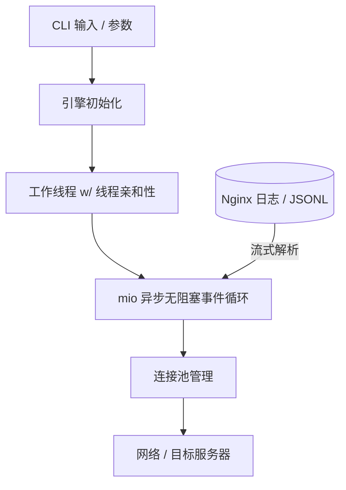

# rload 使用手册

欢迎阅读 `rload` 官方使用手册。`rload` 是一款基于 Rust 编写的高性能 HTTP 压测工具与高保真流量回放引擎。

`rload` 的设计初衷是架起“静态基准测试”（如 `wrk`）与“生产级流量回放”（如阴影测试/影子测试）之间的桥梁。它在保持与标准 `wrk` 命令行参数绝对兼容的同时，原生集成了流式 Nginx 访问日志和结构化 JSONL 请求序列的回放能力。

---

## 目录

1. [架构设计与核心概念](#1-架构设计与核心概念)
2. [安装指南](#2-安装指南)
3. [基础压测基准测试 (wrk 兼容)](#3-基础压测基准测试-wrk-兼容)
4. [Nginx 访问日志回放](#4-nginx-访问日志回放)
5. [结构化 JSONL 请求回放](#5-结构化-jsonl-请求回放)
6. [流量步调控制 (Pacing) 与阶段配置](#6-流量步调控制-pacing-与阶段配置)
7. [指标解读与输出格式](#7-指标解读与输出格式)
8. [生产环境调优与 SRE 最佳实践](#8-生产环境调优与-sre-最佳实践)

---

## 1. 架构设计与核心概念

`rload` 从底层设计上追求极致的运行效率与高精确度，即使在极端的高并发负载下，也能保持极低的系统资源占用。



### 核心架构支柱：
- **异步无阻塞事件循环**：基于 Rust 著名的 `mio` 库构建，`rload` 能够在一组固定的系统线程上轻松调度成千上万个并发连接。
- **线程亲和性与零调度噪声**：工作线程在支持的系统上会自动绑定（钉）到特定的 CPU 核心，极大地减少了内核上下文切换和 CPU 缓存失效（cache-miss），从而保障了延迟直方图度量的精准度。
- **恒定的内存占用 (Constant Memory RSS)**：`rload` 采用流式（Stream-based）解析器，直接按块边读边解析超大规模的日志文件（即使多达数吉字节），而不是将整个文件一次性加载到内存中。这使运行期间的常驻内存（RSS）稳定保持在 `3.5 MiB` 左右。
- **协同遗漏（Coordinated Omission）防护**：在开启流量步调控制（Pacing）时，`rload` 会根据“计划发送时间”而非实际网络发送时间来计算请求延迟，从而完美避免了由于目标服务器卡顿导致客户端测得延迟偏低的传统缺陷。

---

## 2. 安装指南

`rload` 被编译为单一、无任何运行时外部依赖的静态二进制文件。

### 方式 A：使用 Homebrew (macOS & Linux)
您可以通过我们的官方 Tap 快速安装：
```bash
brew install wenhaozhao/rload/rload
```

### 方式 B：使用 Cargo (Rust 工具链)
如果您的环境中安装了 Rust 编译环境，可以直接从 crates.io 进行构建安装：
```bash
cargo install rload
```

### 方式 C：手动下载静态二进制文件
直接在 [GitHub Releases](https://github.com/wenhaozhao/rload/releases) 页面下载对应系统的压缩包，解压并将其移动到系统的可执行路径（`PATH`）中：
```bash
tar -xvf rload-v0.2.2-x86_64-unknown-linux-musl.tar.gz
sudo mv rload /usr/local/bin/
```

### 方式 D：从源码编译
```bash
git clone https://github.com/wenhaozhao/rload.git
cd rload
cargo build --release
# 编译产物位于 target/release/rload
```

验证安装是否成功：
```bash
rload --version
```

---

## 3. 基础压测基准测试 (wrk 兼容)

`rload` 完整支持标准 `wrk` 的基本参数，您可以直接将其作为现有测试脚本中的替代品。

### 常用命令行选项清单

| 短参数 | 长参数选项 | 参数说明 | 默认值 |
|---|---|---|---|
| `-t` | `--threads <N>` | 启动的工作线程数 | `2` |
| `-c` | `--connections <N>` | 并发 TCP 连接数 | `10` |
| `-d` | `--duration <T>` | 压测持续时间（支持 `30s`, `5m`, `2h` 等后缀） | `10s` |
| `-n` | `--requests <N>` | 发送固定数量的请求（设置后会禁用持续时间控制） | 无 |
| `-T` | `--timeout <T>` | 连接和请求套接字超时时间 | `2s` |
| | `--latency` | 显式要求打印延迟分布（默认已强制开启） | 开启 |

### 语法与基础示例

#### 静态 GET 压测：
使用 4 个线程和 100 个并发连接对目标进行 30 秒的压力测试：
```bash
rload -t 4 -c 100 -d 30s http://127.0.0.1:8080/
```

#### 发送固定数量请求：
不限运行时间，精准发送 10,000 个请求后停止：
```bash
rload -t 2 -c 50 -n 10000 http://127.0.0.1:8080/
```

### 版本化 Profile 与 CI 门禁

使用 `--profile` 加载 v1 YAML 工作负载；显式 CLI 参数优先于 profile。profile 可描述静态或回放工作负载、回放过滤和步调、最终断言以及可选的离线 HTML 报告：

```yaml
version: v1
target:
  url: http://127.0.0.1:8080/
runner:
  threads: 2
  connections: 20
  duration: 30s
load_profile:
  mode: static
  static:
    method: GET
observability:
  output_format: json
  output_html: report.html
assertions:
  - expression: "p95 < 50ms"
  - expression: "error_rate < 0.01"
```

```bash
rload --profile rload.yaml --assert "completed > 0"
```

断言基于最终汇总指标评估；失败时进程返回非零状态。支持 `rps`、`mean`、`p50`、`p90`、`p95`、`p99`、`error_rate`、`status_errors`、`socket_errors` 和 `completed`；延迟值支持 `us`、`ms`、`s` 单位。`--output-html report.html` 会写入一个无需网络即可打开、且结果确定的独立报告文件。

---

### 自定义单请求属性

`rload` 提供了兼容 `curl` 风格的参数子集，允许您深度定制请求的方法、请求头和请求体。

- **`-X, --request <METHOD>`**：指定 HTTP 方法（例如 `GET`, `POST`, `PUT`, `DELETE`）。
- **`-H, --header <HEADER>`**：添加自定义请求头，可多次重复指定。必须使用 `'Name: Value'` 语法。
- **`--data <DATA>`**：指定请求体字符串。指定多个 `--data` 时，它们将使用 `&` 符号自动拼接。在不指定 `-X` 的情况下使用 `--data` 会默认将请求方法切换为 `POST`。
- **`--data-binary @FILE`**：将指定文件中的原始二进制内容逐字节作为请求体发送。

#### 携带 Headers 的自定义 POST 请求：
```bash
rload -d 10s -X POST \
  -H 'Content-Type: application/json' \
  -H 'Authorization: Bearer mytoken' \
  --data '{"username":"admin"}' \
  https://example.com/api/login
```

#### 上传二进制文件：
```bash
rload -d 30s -X PUT \
  -H 'Content-Type: image/png' \
  --data-binary @/path/to/image.png \
  https://example.com/upload
```

---

## 4. Nginx 访问日志回放

`rload` 最核心的优势之一是能够以极高的保真度直接回放生产环境中的 Nginx 访问日志。

工具能够流式解析标准的 **Common**（通用）或 **Combined**（组合）Nginx 访问日志，自动提取双引号包裹的 `$request` 字段以还原请求方法、URI 及查询参数，并按需回放至目标服务器。

```bash
rload [OPTIONS] --access-log <LOG_FILE> <TARGET_URL>
```

### 回放配置选项

- **`--replay-order <sequential | shuffle | random>`**：
  - `sequential`（默认值）：按日志行时间顺序回放。当读取到日志末尾时，会自动循环回到文件开头。
  - `shuffle`：将所有记录读入内存中并进行确定性洗牌（打乱顺序）后回放。每轮循环结束时会重新进行洗牌。
  - `random`：每个请求都独立地在日志集合中随机抽样（有放回抽样）进行发送。
- **`--seed <N>`**：设置 64 位整数随机种子，确保 `shuffle` 和 `random` 序列具有完美的跨环境可重现性。
- **`--allowed-methods <LIST>`**：以逗号分隔的方法白名单（例如 `--allowed-methods GET,HEAD`）。仅回放白名单内的方法，其他方法会被跳过并在汇总中计数。
- **`--allowed-uris <GLOBS>`**：逗号分隔的 URI Glob 通配符（例如 `--allowed-uris "/api/v1/*,/products/*"`）。仅回放符合匹配规则的路径。
- **`--replay-rounds <N>`**：将过滤后的完整序列回放指定的 `N` 轮。不能与 `--requests`、`--duration` 或 `random` 排序方式共用。

### 示例

#### 基础顺序日志回放：
对测试环境顺序回放指定的 Nginx 访问日志：
```bash
rload -c 100 -d 5m --access-log /var/log/nginx/access.log https://staging.example.com
```

#### 带有过滤规则和固定种子的洗牌回放：
仅回放 `/search` 开头的 `GET` 请求，使用固定种子打乱顺序回放：
```bash
rload -c 50 -d 1m \
  --access-log ./access.log \
  --replay-order shuffle --seed 42 \
  --allowed-methods GET \
  --allowed-uris "/search*" \
  https://staging.example.com
```

> [!NOTE]
> 标准 Nginx 访问日志回放不支持自定义请求体，因为访问日志本身不记录 POST/PUT 请求体内容。若需要携带请求体，请使用 JSONL 请求回放模式。

---

## 5. 结构化 JSONL 请求回放

在复杂的微服务调用链中，如果压测不仅需要动态 Method 和 URL，还需要定制单独的 HTTP 请求头或携带动态的 JSON/二进制 Payload，您可以使用结构化 JSONL（JSON Lines）格式进行回放。

```bash
rload [OPTIONS] --request-file <JSONL_FILE> <TARGET_URL>
```

### 默认 JSONL 记录格式
默认情况下，`rload` 期望 JSONL 的每一行都包含以下标准顶层字段：
```json
{
  "method": "POST",
  "uri": "/api/v2/items?category=books",
  "headers": {
    "Content-Type": "application/json",
    "X-Session-ID": "a1b2c3d4"
  },
  "body": "{\"item_id\": 42, \"quantity\": 1}",
  "timestamp_micros": 1721012345000000
}
```

### 自定义 Schema 映射 (`--request-schema`)
如果您现有的日志导出格式与标准格式不一致（例如将 HTTP 属性嵌套在 `http.request` 节点下），可以提供一个 YAML 文件来定义抽取路径。

创建一个 Schema 配置文件（例如 `schema.yaml`）：
```yaml
schema_version: 1
fields:
  method:
    path: http.request.method
  uri:
    path: http.request.path
  args:
    path: http.request.query
  headers:
    path: http.request.headers
  body:
    path: http.request.body
  timestamp:
    path: event.timestamp
    format: "%d/%b/%Y:%H:%M:%S.%f %z"
```
并在命令行中加载它：
```bash
rload -c 20 --request-file ./my_traffic.jsonl --request-schema ./schema.yaml https://staging.internal
```

### 处理脏数据与无效记录
默认情况下，`rload` 采取严格加载策略：任何行 JSON 格式错误或 Schema 匹配失败都会导致程序立即报错退出。
- 使用 **`--skip-invalid-records`** 选项可以在加载阶段自动忽略格式错误的记录。
- 忽略的脏记录数量及其原因将被记录、汇总并在最终汇总时输出。

---

## 6. 流量步调控制 (Pacing) 与阶段配置

无节制地全速压测（即连接池能发多快就发多快）常用于测量系统极限，但真实的生产流量往往需要精细化的步调（Pacing）与速率调配。

`rload` 提供了三种主流的速率控制模型：

### 1. 全局回放速率限制 (`--replay-rate`)
在所有工作线程和连接间施加一个恒定的总体吞吐上限。
- **`--replay-rate <RPS>`**：将总体每秒请求数限制在固定的 RPS 数值内。
```bash
rload -c 200 -d 10m --access-log ./access.log --replay-rate 1500 https://target.com
```

### 2. 真实时间戳步调回放 (`--replay-timestamps`)
依据日志或数据文件中记录的原始高精度时间戳，按真实的发生间隔比例发送请求。
- **`--replay-timestamps`**：激活基于时间戳的步调控制。
- **`--replay-speed <N>`**：时间轴缩放系数。`2.0` 表示以双倍速播放（请求间隔减半），`0.5` 表示半速缓慢回放。
```bash
# 将生产环境 24 小时的真实流量在 12 小时内回放完毕（双倍流速）
rload -c 100 --access-log ./access.log --replay-timestamps --replay-speed 2.0 https://target.com
```

### 3. 多阶段动态速率配置 (`--stages`)
定义由多段不同速率（如预热、波峰、降温）组成的复杂负载曲线。适用于静态普通请求和回放请求。
- **`--stages <DURATION:RPS,DURATION:RPS,...>`**：多阶段段落之间使用英文逗号分隔。
- **`--replay-stages`**：回放日志/JSONL 时的完全等效别名。

#### 典型流量曲线示例：
```bash
# 模拟系统波峰：
# 阶段 1：10 秒钟，限速 100 RPS（系统预热）
# 阶段 2：30 秒钟，限速 1000 RPS（模拟波峰冲击）
# 阶段 3：10 秒钟，限速 100 RPS（系统恢复期）
rload -c 100 --stages 10s:100,30s:1000,10s:100 https://target.com
```

---

## 7. 指标解读与输出格式

`rload` 能够全方位精确统计压测与回放的各项性能指标。

### 结果输出格式
1. **`text`（默认选项）**：经典的类似于 `wrk` 的平铺文本，非常适合快速查看。
2. **`--output-beauty`**：带有色彩标记、排版精美且按板块分隔的终端人性化界面。
3. **`--output-format json`**：标准的机器可读单行/多行 JSON 文档，用于 CI/CD 自动化分析流水线、告警组件和监控看板。

### 命令行输出示例
```
Running 30s test @ https://staging.example.com
  4 threads and 100 connections

Thread Stats   Avg      Max     +/- Stdev
  Latency     4.12ms   42.15ms    86.20%
  Req/Sec    12.45k   14.82k     71.10%

  1485293 requests in 30.00s, 3.24GB read
Requests/sec:   49,509.76
Average latency: 4.12ms
99% Latency:     18.15ms
Socket errors: connect 0, read 0, write 0, timeout 0
```

---

### 理解套接字错误与重连恢复机制

`rload` 将通信层捕获的各类异常细分为以下四大类：
- **`connect`**：TCP 握手失败（例如连接被拒绝 Connection Refused、主机不可达等）。
- **`read`**：读取响应时发生意外 EOF、SSL 解密错误或连接由于网络中断意外重置。
- **`write`**：无法向套接字发送缓冲区写入字节。
- **`timeout`**：在指定的 `-T/--timeout` 超时时间内未收到服务器响应。

#### 重连自愈机制：
- **在持续时间模式（`-d`）下**：如果发生任意套接字异常，工作线程会自动隔离故障连接，执行优雅销毁，重新建立 TCP 握手并自动完成 TLS SNI 证书协商，确保在整个测试时间内源源不断地生成预定压力。
- **在固定请求数模式（`-n`）下**：重连自愈被禁用。连接出错将导致程序立即报错退出，从而防止因目标服务器永久宕机而导致测试进程无限等待。

---

### JSON 结果结构体定义说明 (`--output-format json`)

导出的 JSON 文档中各指标项含义如下：

```json
{
  "schema_version": 1,
  "target_url": "https://staging.example.com/",
  "duration_micros": 30000214,         // 运行总时间，单位：微秒
  "threads": 4,                         // 线程数
  "connections": 100,                   // 并发连接数
  "completed_requests": 1485293,        // 已成功完成的请求数
  "bytes_read": 3478921312,             // 读取套接字总字节数
  "bytes_written": 284192010,           // 写入套接字总字节数
  "requests_per_sec": 49509.76,         // 实测每秒请求数 (RPS)
  "latency": {
    "minimum_us": 210,                  // 最小延迟（微秒）
    "maximum_us": 42150,                // 最大延迟（微秒）
    "average_us": 4120,                 // 平均延迟（微秒）
    "median_us": 3810,                  // 中位数延迟（微秒）
    "p50_us": 3810,                     // 与 median_us 相同
    "p75_us": 4910,
    "p90_us": 8200,
    "p95_us": 12100,
    "p99_us": 18150
  },
  "socket_errors": {                    // 网络套接字错误细分计数
    "connect": 0,
    "read": 0,
    "write": 0,
    "timeout": 0
  },
  "http_status_counts": {               // 状态码分布计数
    "200": 1485193,
    "500": 100
  },
  "top_uris": [                         // 前 20 位重度访问 URI 估算
    {
      "uri": "/api/v1/products",
      "estimate": 842100,               // 估算访问次数
      "max_error": 0                    // 算法估计的最大误差（0表示无误差）
    },
    {
      "uri": "/api/v1/search",
      "estimate": 643193,
      "max_error": 0
    }
  ]
}
```

---

## 8. 生产环境调优与 SRE 最佳实践

在超高吞吐、极高并发的网络压测和回放场景中，客户端自身的系统调优对于保障测试准确性至关重要：

### 系统文件句柄数上限 (File Descriptor Limit)
每个活跃的 TCP 连接在操作系统中都占用一个文件描述符。在 macOS 和 Linux 系统上，默认的最大句柄数限制通常极低（如 256 或 1024）。
在开启数千连接的压测前，必须提高当前 Shell 会话的上限：
```bash
# 查看当前限制
ulimit -n

# 临时将当前 Shell 的句柄上限提升到 65535
ulimit -n 65535
```

### CPU 核数与线程配比
- **线程数设置原则**：建议将工作线程数 `-t / --threads` 设定为与运行主机的物理/逻辑 CPU 核心数保持一致（1:1）。如果将线程数设置得明显高于物理核心数，会导致频繁的系统上下文切换，严重影响高百分位延迟（P99, P99.9）的真实性。
- **连接平衡分配**：尽量让 `connections / threads` 的比值成为整数，确保各线程管理的套接字任务分布均匀。例如使用 `-t 4` 时，设置 `-c 100`（每个线程负载 25 个并发连接）。

### 协同遗漏问题的自愈与分析
当服务器因垃圾回收（GC）、慢查询或队列积压发生短暂挂起（Stall）时，传统的压力工具（由于其串行发送设计）会一同挂起等待，这导致随后的请求没有在预定时刻发送。
这种现象被称为 **协同遗漏（Coordinated Omission）**，它会使得客户端报告的平均延迟显得比真实世界中的要快得多。

`rload` 是如何帮您避免此陷阱的：
- 在激活速率限制（如 `--replay-rate` 或 `--stages`）时，`rload` 内部的时间调度器会严格按固定间隔计划请求的发送时刻。
- 若连接因为网络阻塞或服务器宕机未能按时发出，`rload` 在计算延迟时，会将 **“实测响应到达时刻”减去“理论计划发送时刻”**。
- 这能够高真还原真实的排队延迟（Queueing Delay），为 SRE 提供最符合真实业务感受的延迟指标。
